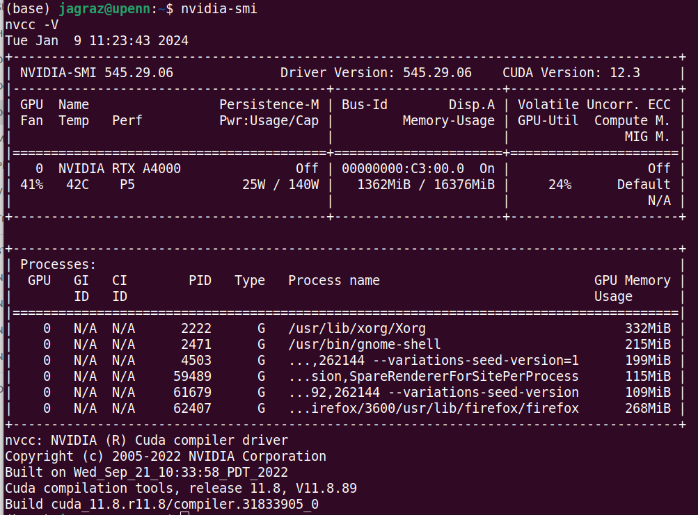

# How to install CUDA & cudNN with nVidia RTX A4000 support on Ubuntu 22.04

Description: Comprehensive instructions for installing the NVIDIA A4000 driver, CUDA, and cuDNN on Ubuntu 22, tailored for computer parallel processing with PyTorch and TensorFlow. These guidelines aim to facilitate optimal setup for high-performance computing tasks in genomics  
Note 1: Register with nVidia to download packages [here](https://developer.nvidia.com/developer-program/signup)  
Note 2: Keep in mind when something goes wrong, it's much easier to re-install Ubuntu than trying to uninstall CUDA or cudNN  

## Steps Overview ####  
1) Install a fresh Ubuntu copy
2) ownload and install the nvidia cuda toolkit and cudnn
3) Setup environmental variables
4) Verify the installation

## Hardware  
- CPU Xeon W-3323 3.50GHz × 24 cores
- GIGABYTE MU72-SU0-00
- RAM: 512.0 GiB
- NVIDIA RTX A4000
- 1TB Hard Disk
  
## Instructions  
1) Install a new copy of 
[Ubuntu 22](https://www.ubuntu.com).  
2) Remove any previous installation & update  
   ```text     
   sudo apt purge nvidia* -y  
   sudo apt remove nvidia-* -y  
   sudo rm /etc/apt/sources.list.d/cuda*  
   sudo apt autoremove -y && sudo apt autoclean -y  
   sudo rm -rf /usr/local/cuda*  
   sudo apt update && sudo apt upgrade -y
   ```
3) install other import packages  
   ```text 
   sudo apt install g++ freeglut3-dev build-essential libx11-dev libxmu-dev libxi-dev libglu1-mesa libglu1-mesa-dev
   ```
4) Get PPA repository driver
   ```text   
   sudo add-apt-repository ppa:graphics-drivers/ppa
   sudo apt update
   ```
5) Find recommended driver versions (I used 545)
   ```text   
   ubuntu-drivers devices
   ```
6) Install nvidia driver with dependencies  
   ```text    
   sudo apt install libnvidia-common-545 libnvidia-gl-545 nvidia-driver-545 -y
   ```
7) Reboot in order for changes to take place  
   ```text  
   sudo reboot 
   ```
8) Verify driver installation
   ```text   
   nvidia-smi
   ```
9) Get CUDA
   ```text    
   sudo wget https://developer.download.nvidia.com/compute/cuda/repos/ubuntu2204/x86_64/cuda-ubuntu2204.pin
   sudo mv cuda-ubuntu2204.pin /etc/apt/preferences.d/cuda-repository-pin-600
   sudo apt-key adv --fetch-keys https://developer.download.nvidia.com/compute/cuda/repos/ubuntu2204/x86_64/3bf863cc.pub
   sudo add-apt-repository "deb https://developer.download.nvidia.com/compute/cuda/repos/ubuntu2204/x86_64/ /"
   ```
10) Update and upgrade
   ```text    
sudo apt update && sudo apt upgrade -y
   ```
11) Installing CUDA-11.8
   ```text    
    sudo apt install cuda-11-8 -y
   ```
12) Setup paths in .bashrc
   ```text  
   echo 'export PATH=/usr/local/cuda-11.8/bin:$PATH' >> ~/.bashrc
   echo 'export LD_LIBRARY_PATH=/usr/local/cuda-11.8/lib64:$LD_LIBRARY_PATH' >> ~/.bashrc
   source ~/.bashrc
   sudo ldconfig
   ```
13) Install cuDNN v11   
   ```text  
CUDNN_TAR_FILE="cudnn-linux-x86_64-8.7.0.84_cuda11-archive.tar.xz"
sudo wget https://developer.download.nvidia.com/compute/redist/cudnn/v8.7.0/local_installers/11.8/cudnn-linux-x86_64-8.7.0.84_cuda11-archive.tar.xz
sudo tar -xvf ${CUDNN_TAR_FILE}
sudo mv cudnn-linux-x86_64-8.7.0.84_cuda11-archive cuda
   ```
14) Copy the following files into the cuda toolkit directory
   ```text   
sudo cp -P cuda/include/cudnn.h /usr/local/cuda-11.8/include
sudo cp -P cuda/lib/libcudnn* /usr/local/cuda-11.8/lib64/
sudo chmod a+r /usr/local/cuda-11.8/lib64/libcudnn*
   ```
15) Verify installation
   ```text  
nvidia-smi
nvcc -V
   ```
## Output should look as shown  


Reference: [Thanks so much to Mihail-Cosmin Munteanu](https://gist.github.com/MihailCosmin/affa6b1b71b43787e9228c25fe15aeba)  
